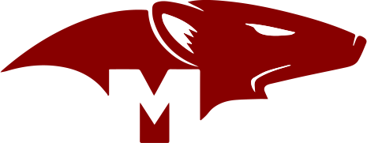

<p align="center">
   <br/>
   <a href="https://next-auth.js.org" target="_blank"></a>&nbsp;&nbsp;&nbsp;&nbsp;
   <h3 align="center"><b>Mongoose Adapter</b> - NextAuth.js</h3>
   <p align="center">
   Open Source. Full Stack. Own Your Data.
   </p>
</p>

## Overview

This is the Mongoose Adapter for [`next-auth`](https://next-auth.js.org). This package can only be used in conjunction with the primary `next-auth` package. It is not a standalone package.

## Getting Started

1. Install `mongoose`, `next-auth` and `@next-auth/mongoose-adapter`

```js
npm install mongoose next-auth @next-auth/mongoose-adapter@next
```

2. Add a MongoDB URI to environment variables file
```env
MONGODB_URI=mongodb://localhost:27017/example
```

3. Add this adapter to your `pages/api/[...nextauth].js` next-auth configuration object.

```js
import NextAuth from "next-auth"
import { MongooseAdapter } from "@next-auth/mongoose-adapter"

// For more information on each option (and a full list of options) go to
// https://next-auth.js.org/configuration/options
export default NextAuth({
  adapter: MongooseAdapter(process.env.MONGODB_URI),
  ...
})
```

## Contributing

We're open to all community contributions! If you'd like to contribute in any way, please read our [Contributing Guide](https://github.com/nextauthjs/adapters/blob/main/CONTRIBUTING.md).

## License

ISC
